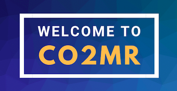
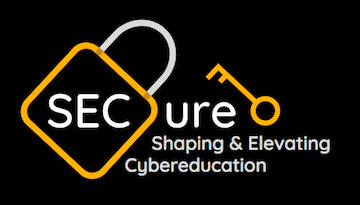

# Chris McVey
## About Me

     
I am currently a second-year student at NYU pursuing a joint major in Computer Science and Economics. I am interested in exploring positions where I can utilize my coding skills, knowledge of economic analysis, and passion for Data Science.

In the modern world, Data Science can create relevant solutions to some of our most pressing issues. As technology continues to progress, the influence of data analytics will only grow further. I hope to someday be at the forefront of analytical research and drive future solutions for the betterment of our world.

## Contact

Email: cjm805@nyu.edu 
LinkedIn: [Chris McVey](https://www.linkedin.com/in/chris-mcvey-687107224/)

## Projects
### [C02mr](https://github.com/ChrisMcVey1/co2mr)

I collaborated with two other NYU students and programmed a platform within a 48-hour time constraint called CO2mr (CO Tomorrow) that connects clients such as architects, engineers, and contractors to Carbon Tech alternative materials to use in their projects that will store carbon and reduce greenhouse gas emissions. We were awarded for our program based on its sustainable impact, uniqueness and originality, and potential for large-scale growth.

### [SECure](https://github.com/ChrisMcVey1/SECure)

I developed SECure alongside a small team of NYU students. The project is committed to alleviating poverty across the globe through Cybersecurity education. We aim to reduce the gap between the world's high demand for Cybersecurity skills and low supply of trained employees in the field. Through SECure, clients can fulfill all of the requirements necessary for entering the Cybersecurity field in a much more economical and accessible way. We provide low-cost courses, exposure to experts and mentors in the field, and specialized tracks to gain certifications in Cybersecurity. Clients will not only SECure a career in a high demanding and growing industry, but help SECure the virtual world as we know it.

### [NYU Project Outreach](https://imgur.com/UrTR68O)

Project Outreach is a program that involves service and civic engagement for selected first-year students prior to the beginning of their education at NYU. I worked with a team of students to launch a social justice initiative by producing stickers with a QR-code to be posted in Manhattan that links to a website created by my team. Our linked website outlines what groups are indigenous to the respective area and the information that should be considered when advocating for these native groups.
